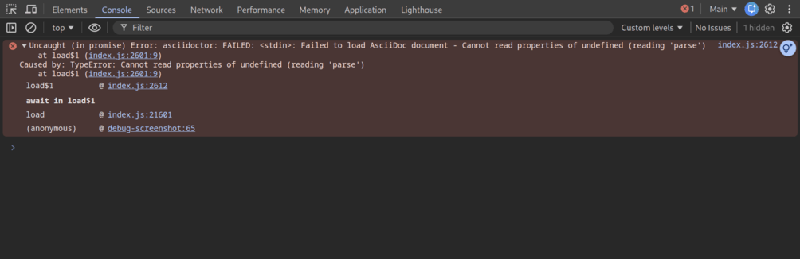
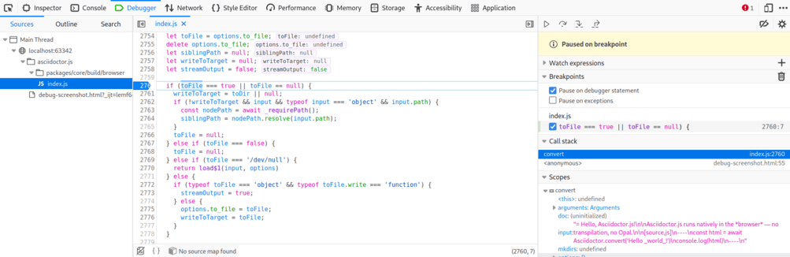

= Contributing Code
// settings:
:experimental:
:idprefix:
:idseparator: -
:toc: preamble
// URIs:
:uri-nodejs: https://nodejs.org
:uri-volta: https://volta.sh
:uri-asciidoctor: https://asciidoctor.org
:uri-asciidoctor-rb: https://github.com/asciidoctor/asciidoctor
:uri-repo: https://github.com/asciidoctor/asciidoctor.js
:uri-biome: https://biomejs.dev
:uri-vitest: https://vitest.dev
:uri-claude-code: https://claude.ai/code

This guide will give you all the necessary information you need to become a successful Asciidoctor.js developer and code contributor!

== Introduction

{uri-repo}[Asciidoctor.js] is a native JavaScript port of {uri-asciidoctor}[Asciidoctor].
The `@asciidoctor/core` package is a handwritten/AI-translated ES module that mirrors the {uri-asciidoctor-rb}[Asciidoctor Ruby source], file by file, without any transpilation step.

The initial port was produced by {uri-claude-code}[Claude Code] (claude-sonnet-4-6) from the Asciidoctor Ruby source and reviewed by human maintainers.
The public API is intentionally kept compatible with the previous Opal-based releases, with the main breaking change being that all entry points (`load`, `loadFile`, `convert`, `convertFile`) are now `async`.

Each source file under `packages/core/src/` corresponds to a Ruby file in the upstream repository and carries a header comment documenting the translation decisions made for that module (Ruby idioms → JavaScript equivalents, circular dependency workarounds, etc.).

== Setup

To work on Asciidoctor.js you need:

* {uri-nodejs}[Node.js] >= 24 and npm (we recommend {uri-volta}[Volta] to manage Node.js versions — the repository already pins the correct version via `volta` in `package.json`)

Clone the repository and install dependencies:

[source,bash]
----
git clone https://github.com/asciidoctor/asciidoctor.js.git
cd asciidoctor.js
npm i
----

== Building

=== Building the package

[source,bash]
----
npm run build -w @asciidoctor/core
----

This produces the following artifacts in `packages/core/build/`:

* `browser/index.js` — browser-optimised ES module bundle (Rollup)
* `node/index.cjs` — CommonJS bundle for older Node.js toolchains

The source entry point (`src/index.js`) is used as-is in ES module environments; no build step is required for development.

=== Generating TypeScript types

Type definitions are generated from JSDoc annotations using the TypeScript compiler in declaration-emit mode:

[source,bash]
----
npm run build:types -w @asciidoctor/core
----

Output lands in `packages/core/types/`.
`@internal`-tagged symbols are stripped from the emitted `.d.ts` by a post-processing script (`scripts/strip-internal.js`).

== Testing

=== Running all tests

[source,bash]
----
npm test
----

This runs the root-level tests followed by all workspace test suites.

=== Running the Node.js test suite

[source,bash]
----
npm test -w @asciidoctor/core
----

Tests use the Node.js built-in runner (`node:test` / `node:assert/strict`).
The suite contains over 2,300 tests ported from the Asciidoctor Ruby test suite.

=== Running the CLI test suite

[source,bash]
----
npm test -w asciidoctor
----

=== Running the browser test suite

[source,bash]
----
npm run test:browser -w @asciidoctor/core
----

This runs the same test files through {uri-vitest}[Vitest] with a Playwright/Chromium provider.
Node.js built-ins (`node:fs`, `node:path`, etc.) are shimmed so that browser-incompatible code paths are exercised via their browser equivalents (`fetch`, `URL`, etc.).

A small number of test files are excluded from the browser run because they require a running Node.js HTTP server or Node.js-specific infrastructure (see `vitest.browser.config.js`).

== Linting and formatting

The project uses {uri-biome}[Biome] for both linting and formatting (replacing the previous ESLint + Standard setup).

[source,bash]
----
# Lint
npm run lint -w @asciidoctor/core

# Format (in-place)
npm run format -w @asciidoctor/core

# Lint + format check (CI mode)
npm run check -w @asciidoctor/core
----

== Debugging

=== Chrome / Chromium

Chrome (and Chromium) has a very intuitive JavaScript console.
To open it, press kbd:[Ctrl+Shift+J] or right-click on the page, select menu:Inspect Element[] from the context menu and click the *Console* tab.

When an error occurs, Chrome will print the error message to the console.
Click on the arrow at the start of the line to expand the call trace, as shown here:

When you identify the entry you want to inspect, click the link to the source location.
If you want to inspect the state, add a breakpoint and refresh the page.

Chrome tends to cache JavaScript files aggressively when running local scripts.
Hold down kbd:[Ctrl] when you click refresh to force Chrome to reload the JavaScript.

=== Firefox

Firefox also has a JavaScript console.
To open it, press kbd:[Ctrl+Shift+J] or right-click on the page, select menu:Inspect Element[] from the context menu and click the *Web Console* tab.

To see the call trace when an exception occurs, configure the Debugger to pause on exceptions.
Click the *Debugger* tab, click the configuration gear icon in the upper right corner and click *Pause on exceptions*.
Refresh the page — the debugger will pause at the location in the source where the exception is thrown.

The call trace is displayed as breadcrumb navigation, which you can use to jump through the stack.
You can inspect the state at any location by looking through the panels on the right.

== Adding a test

All tests use the Node.js built-in test runner (`node:test`, `node:assert/strict`).
No test framework is required; just import what you need from the standard library.

=== Core tests (`packages/core/test/`)

Test files mirror the structure of the Asciidoctor Ruby test suite and are grouped by feature area (e.g., `blocks.images.test.js`, `document.test.js`).

To add a test for a new or existing behaviour:

. Find the relevant test file in `packages/core/test/` — or create a new one following the `<feature-area>.test.js` naming convention.
. Import the test helpers and harness at the top:
+
[source,js]
----
import { test, describe } from 'node:test'
import assert from 'node:assert/strict'
import { convertStringToEmbedded, documentFromString } from './harness.js'
import { assertXpath } from './helpers.js'
----
. Write the test using `describe` + `test`, and `await` the async conversion functions:
+
[source,js]
----
describe('My feature', () => {
  test('does the right thing', async () => {
    const output = await convertStringToEmbedded('some _asciidoc_ input')
    assertXpath(output, '//em[text()="asciidoc"]', 1)
  })
})
----
. Run the suite to verify:
+
[source,bash]
----
npm test -w @asciidoctor/core
----

=== CLI tests (`packages/asciidoctor/test/cli.test.js`)

CLI tests spawn the `bin/asciidoctor` binary via `spawnSync` and assert on exit code, stdout, and stderr.

[source,js]
----
import { test, describe } from 'node:test'
import assert from 'node:assert/strict'
import { spawnSync } from 'node:child_process'
import { join, dirname } from 'node:path'
import { fileURLToPath } from 'node:url'

const __dirname = dirname(fileURLToPath(import.meta.url))
const CLI = join(__dirname, '..', 'bin', 'asciidoctor')

function cli(args, opts = {}) {
  return spawnSync(process.execPath, [CLI, ...args], { encoding: 'utf8', ...opts })
}

describe('My CLI feature', () => {
  test('--my-flag behaves correctly', () => {
    const result = cli(['--my-flag'])
    assert.equal(result.status, 0)
    assert.match(result.stdout, /expected output/)
  })
})
----

Run with:

[source,bash]
----
npm test -w asciidoctor
----

== Contributing a change

When porting behaviour from the Ruby source or fixing a bug:

. Locate the corresponding Ruby file in the {uri-asciidoctor-rb}[asciidoctor/asciidoctor] repository and cross-reference it with the equivalent file in `packages/core/src/`.
. Follow the translation conventions documented at the top of each source file and in `packages/core/CLAUDE.md`.
. Add or update tests in `packages/core/test/` — the test files mirror the structure of the Ruby test suite.
. Run both the Node.js and browser test suites before submitting a pull request.
