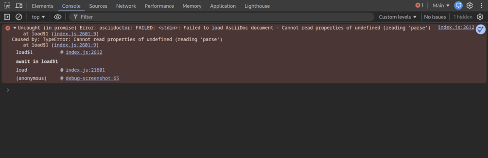
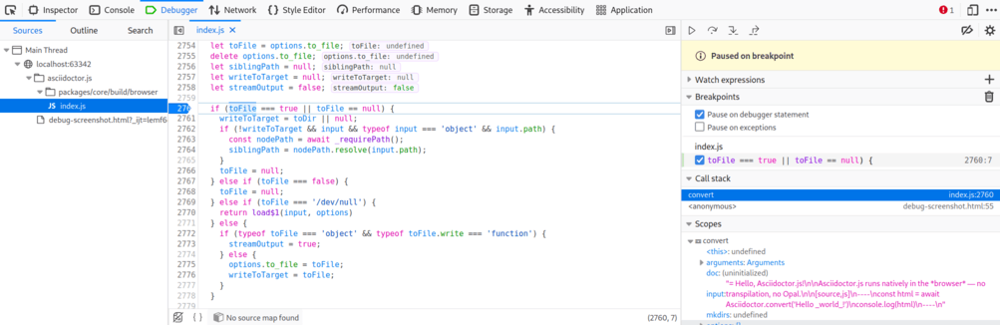

= Asciidoctor.js: AsciiDoc in JavaScript powered by Asciidoctor
Dan Allen <https://github.com/mojavelinux[@mojavelinux]>; Guillaume Grossetie <https://github.com/mogztter[@mogztter]>; Anthonny Quérouil <https://github.com/anthonny[@anthonny]>
:idprefix:
:idseparator: -
:uri-nodejs: http://nodejs.org
:uri-opal: http://opalrb.org
:uri-asciidoctor: http://asciidoctor.org
:uri-bower: http://bower.io
:uri-repo: https://github.com/asciidoctor/asciidoctor.js
:sources: {uri-repo}
:license: {uri-repo}/blob/master/LICENSE
:experimental:
:endash:

ifdef::env-github[]
image:http://img.shields.io/travis/asciidoctor/asciidoctor.js.svg[Build Status, link=https://travis-ci.org/asciidoctor/asciidoctor.js]
image:http://img.shields.io/npm/v/asciidoctor.js.svg[npm version, link=https://www.npmjs.org/package/asciidoctor.js]
endif::[]

This project uses {uri-opal}[Opal] to transcompile http://asciidoctor.org[Asciidoctor]—a modern implementation of AsciiDoc—from Ruby to JavaScript to produce [path]_asciidoctor.js_, bringing http://asciidoc.org[AsciiDoc] to the browser!

== Introduction

{sources}[Asciidoctor.js] is direct port of {uri-asciidoctor}[Asciidoctor] from Ruby to JavaScript using {uri-opal}[Opal], a Ruby-to-JavaScript transcompiler.
It consists of a Rake build script that executes the Opal compiler on the Asciidoctor source code to produce the asciidoctor.js script.
A Grunt build is used to assemble and prepare the distribution files, using the Rake build underneath.

Opal parses the Ruby code and any required libraries, then rewrites the code into JavaScript under the Opal namespace.
The resulting JavaScript can be executed within any JavaScript runtime environment (such as a browser).

To interact with the generated code, you either invoke the JavaScript APIs directly, or you can invoke native JavaScript objects from within the Ruby code prior to compilation.

== Setup

To build [path]_asciidoctor.js_, you'll need some tools:

* {uri-nodejs}[Node.js] and npm
* {uri-bower}[Bower]
* Rake and Bundle

Start by cloning the source from GitHub:

 $ git clone git://github.com/asciidoctor/asciidoctor.js

Next, switch to the _asciidoctor.js_ directory and run npm's `install` command followed by Bower's `install` command:

 $ cd asciidoctor.js
 $ npm install
 $ bower install

You're now ready to build asciidoctor.js.

TIP: Opal.js, The Ruby runtime in JavaScript is available in `bower_components/opal/opal/current/opal.min.js`

== Building asciidoctor.js

To build asciidoctor.js, simple run the Grunt `dist` task from the root of the project:

 $ grunt dist

NOTE: The build task will make some minor code changes on the asciidoctor submodule.
As you may know String are immutable in Javascript, so we need to replace `gsub!` and `sub!` methods.
These changes are made at build time to keep the Ruby code as fast as possible.

This command produces some files in the [path]_dist_ directory:

* *dist/*
- *asciidoctor.js* (includes core and extensions)
- *asciidoctor-core.js* (no extensions API)
- *asciidoctor-extensions.js* (extensions API only)
- *asciidoctor-docbook.js* (docbook backends : docbook45 and docbook5)
- *asciidoctor-all.js* (core, extension and Opal. Docbook isn't the main target of webapp, for this reason we choose to keep it separate)

* *dist/npm* (to use with Npm)
- *asciidoctor-core.js* (no extensions API, will automatically load docbook backends)
- *asciidoctor-extensions.js* (extensions API only)
- *asciidoctor-docbook.js* (docbook backends : docbook45 and docbook5)

Each file has a `minified` and `gz` version.

You'll see these scripts in action when you run the examples, described next.

== Building and running the examples

To build the examples, simply run the Rake `examples` task from the root of the project:

 $ grunt examples

This command produces another JavaScript file in the [path]_build_ directory, [path]_asciidoctor_example.js_.
This script includes:

* a string that contains an AsciiDoc source document
* a call to the Asciidoctor API to render the content of that string to HTML
* an event listener that inserts the generated HTML into the page

All the JavaScript in that file was generated from a Ruby script by Opal.

Point your browser at [path]_build/asciidoctor_example.html_.
You should see the AsciiDoc Syntax Quick Reference document.
The content on the page was rendered from AsciiDoc by asciidoctor.js when you loaded the page!

== Using Asciidoctor in JavaScript

There are two ways to use the JavaScript version of Asciidoctor:

. Write code in Ruby that hooks into the native JavaScript environment, which Opal compiles into JavaScript
. Invoke the JavaScript APIs that Opal generates directly from JavaScript

=== Using Asciidoctor and the native JavaScript environment from Ruby

First, we'll stuff some AsciiDoc content into a variable inside a Ruby script:

[source,ruby]
----
content = <<-EOS
= asciidoctor.js, AsciiDoc in JavaScript
Doc Writer <docwriter@example.com>

Asciidoctor and Opal come together to bring
http://asciidoc.org[AsciiDoc] to the browser!

== Technologies

* AsciiDoc
* Asciidoctor
* Opal

NOTE: That's all she wrote!
EOS
----

Next, we invoke Asciidoctor in Ruby just as we normally would:

[source,ruby]
----
html = Asciidoctor.convert(content, :safe => :safe,
  :attributes => %w(showtitle anchors imagesdir=./images))
----

We then use the global `$window` object provided by Opal to register a listener that inserts the rendered HTML document into the page:

[source,ruby]
----
$window.addEventListener 'DOMContentLoaded', proc {
  $document.getElementById('content').innerHTML = html
}, false
----

The final step is to compile this Ruby code into JavaScript using the Opal compiler.

[source,ruby]
----
env = Opal::Environment.new
env.append_path 'examples'
compiled = env['asciidoctor_example'].to_s
File.open('build/asciidoctor_example.js', 'w') { |f| f << compiled }
----

When the [path]_asciidoctor_example.js_ script is loaded by the browser, the Ruby code (compiled as JavaScript) is executed, rendering the AsciiDoc document and inserting the result into the page.

You can also invoke Asciidoctor directly from JavaScript.

== Using Asciidoctor from JavaScript

If you choose, you may use the Asciidoctor class that Opal generates directly from Ruby.

=== Front-end development

[source, bash]
.Installing Asciidoctor.js with Bower
----
$ bower install asciidoctor.js --save
----

Once the package installed, you can add the following `script` tag to your HTML page:

[source,html]
----

<!-- If you need docbook backends -->

----

If you don't want to use *extensions*, you can load files separately :

[source,html]
----

<!-- If you need docbook backends -->

----

IMPORTANT: To be successful with Asciidoctor.js, it's important to understand how to work with Ruby objects in the JavaScript environment.
We recommend that you browse the http://opalrb.org/docs/using_ruby_from_javascript[Opal documentation] to learn how method names are mapped and what data types it expects.

Here is a simple example that converts AsciiDoc to HTML5 using the `doctype: 'inline'` option and `showtitle` attribute:

.sample.js
[source,javascript]
----
var content = "http://asciidoctor.org[*Asciidoctor*] " +
    "running on http://opalrb.org[_Opal_] " +
    "brings AsciiDoc to the browser!";
var options = Opal.hash2(['doctype', 'attributes'], {doctype: 'inline', attributes: ['showtitle']});
var html = Opal.Asciidoctor.$convert(content, options);
console.log(html);
----

Here's an example that demonstrates how to read attributes defined in the AsciiDoc source once the document is loaded.

[source,javascript]
----
var doc = Opal.Asciidoctor.$load(content, options);
var attrs = {};
doc.attributes.keys.forEach(function(key) {
  attrs[key] = doc.attributes.map[key];
});
var doctitle = doc.doctitle;
----

=== Back-end development

[source, bash]
.Installing Asciidoctor.js with npm
----
$ npm install asciidoctor.js --save
----

Once the package is installed, the first thing to do is to load the `asciidoctor.js` module using `require`, then you're ready to start using the API:

.sample.js
[source,javascript]
----
var asciidoctor = require('asciidoctor.js')(); // <1>
var opal = asciidoctor.Opal; // <2>

var processor = null;
var useExtensions = true;

if (useExtensions) {
  processor = asciidoctor.Asciidoctor(true); // <3>
}
else {
  processor = asciidoctor.Asciidoctor(); // <4>
}

var content = "http://asciidoctor.org[*Asciidoctor*] " +
    "running on http://opalrb.org[_Opal_] " +
    "brings AsciiDoc to Node.js!";
var options = opal.hash2(
    ['doctype', 'attributes'],
    {doctype: 'inline', attributes: ['showtitle']});
var html = processor.$convert(content, options); // <5>
console.log(html); // <6>
----
<1> Load the Asciidoctor.js library
<2> Retrieve and alias the top-level Opal namespace
<3> Instantiate Asciidoctor with extensions enabled
<4> Instantiate Asciidoctor without extensions
<5> Convert AsciiDoc content to HTML5 using Asciidoctor.js
<6> Print the HTML5 output to the console

Save the file as `sample.js` and run it using the `node` command:

 $ node sample.js

You should see the following output in your terminal:

[.output]
....
<a href="http://asciidoctor.org"><strong>Asciidoctor</strong></a> running on <a href="http://opalrb.org"><em>Opal</em></a> brings AsciiDoc to Node.js!

....

== Changes to Asciidoctor (from upstream)

Compiling Asciidoctor to JavaScript currently requires some changes in Asciidoctor.
The goal is to eventually eliminate all of these differences so that Asciidoctor can be compiled to JavaScript as is.

Here's a list of some of the changes that are currently needed:

* Named posix groups in regular expressions are replaced with their ASCII equivalent
  - JavaScript doesn't support named posix groups, such as [x-]`[[:alpha:]]`)
* A shim library is needed to implement missing classes in Opal, such as `File` and `Dir`
* All mutable String operations have been replaced with assignments (this is done at build time)
  - JavaScript doesn't support mutable strings
* `$~[0]` used in place of `$&` and `$~[n]` in place of `$n` after running a regular expression (where n is 1, 2, 3...)
* Opal doesn't recognize modifiers on a regular expression (e.g., multiline)
* Optional, non-matching capture groups resolve to empty string in gsub block in Firefox (see http://www.bennadel.com/blog/1916-different-browsers-use-different-non-matching-captured-regex-pattern-values.htm)
* Assignments without a matching value are set to empty string instead of nil (in the following example, `b` is set to empty string)

  a, b = "value".split ',', 2

* ...

== Debugging

Compiling a Ruby application to JavaScript and getting it to run is a process of eliminating fatal errors.
When the JavaScript fails, the message isn't always clear or even close to where things went wrong.
The key to working through these failures is to use the browser's JavaScript console.

=== Chrome / Chromium

Chrome (and Chromium) has a very intuitive JavaScript console.
To open it, press kbd:[Ctrl+Shift+J] or right-click on the page, select menu:Inspect Element[] from the context menu and click the *Console* tab.

When an error occurs in the JavaScript, Chrome will print the error message to the console.
The error message is interactive.
Click on the arrow at the start of the line to expand the call trace, as shown here:

When you identify the entry you want to inspect, click the link to the source location.
If you want to inspect the state, add a breakpoint and refresh the page.

Chrome tends to cache the JavaScript files too aggressively when running local scripts.
Make a habit of holding down kbd:[Ctrl] when you click refresh to force Chrome to reload the JavaScript.

Another option is to start Chrome with the application cache disabled.

 $ chrome --disable-application-cache

=== Firefox

Firefox also has a JavaScript console.
To open it, press kbd:[Ctrl+Shift+J] or right-click on the page, select menu:Inspect Element[] from the context menu and click the *Web Console* tab.

When an error occurs in the JavaScript, Firefox will print the error message to the console.
Unlike Chrome, the error message is not interactive.
Its power, instead, lies under the hood.

To see the call trace when an exception occurs, you need to configure the Debugger to pause on an exception.
Click the *Debugger* tab, click the configuration gear icon in the upper right corner of that tab and click *Pause on exceptions*.
Refresh the page and you'll notice that the debugger has paused at the location in the source where the exception is thrown.

The call trace is displayed as breadcrumb navigation, which you can use to jump through the stack.
You can inspect the state at any location by looking through the panels on the right.

== Copyright

Copyright (C) 2014 Dan Allen, Guillaume Grossetie, Anthonny Quérouil and the Asciidoctor Project.
Free use of this software is granted under the terms of the MIT License.

See the {license}[LICENSE] file for details.
